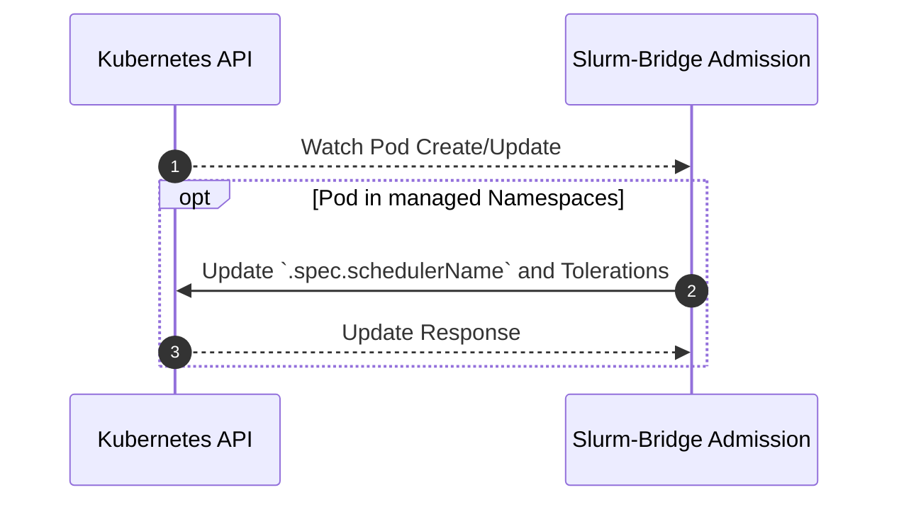

# Admission

## Table of Contents

<!-- mdformat-toc start --slug=github --no-anchors --maxlevel=6 --minlevel=1 -->

- [Admission](#admission)
  - [Table of Contents](#table-of-contents)
  - [Overview](#overview)
  - [Design](#design)
    - [Sequence Diagram](#sequence-diagram)

<!-- mdformat-toc end -->

## Overview

[The Kubernetes documentation](https://kubernetes.io/docs/reference/access-authn-authz/admission-controllers/)
defines admission controllers as:

> a piece of code that intercepts requests to the Kubernetes API server prior to
> persistence of the resource, but after the request is authenticated and
> authorized.

It also states that:

> Admission control mechanisms may be validating, mutating, or both. Mutating
> controllers may modify the data for the resource being modified; validating
> controllers may not.

The `slurm-bridge` admission controller is a mutating controller. It modifies
any pods within namespaces specified in `helm/slurm-bridge/values.yaml` to use
the `slurm-bridge` [scheduler] instead of the default Kubernetes scheduler.

## Design

Any pods created in the specified namespaces will have their
`.spec. schedulerName` changed to the slurm-bridge [scheduler].

Managed namespaces are defined as a list of namespace as configured in the
admission controller's `values.yaml` for `managedNamespaces[]`. Alternatively, a
`managedNamespaceSelector` can be used to select namespaces based on labels. If
`managedNamespaceSelector` is set, `managedNamespaces` will be ignored.

### Sequence Diagram

<!-- Links -->

[scheduler]: scheduler.md
