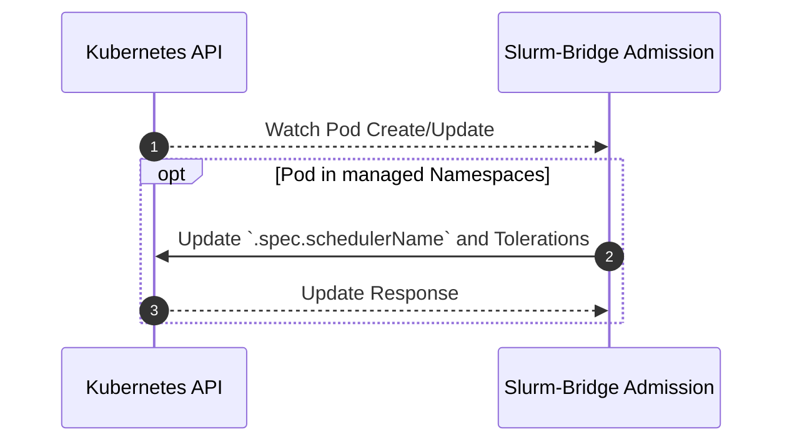

# Admission

## Table of Contents

<!-- mdformat-toc start --slug=github --no-anchors --maxlevel=6 --minlevel=1 -->

- [Admission](#admission)
  - [Table of Contents](#table-of-contents)
  - [Overview](#overview)
  - [Design](#design)
    - [Sequence Diagram](#sequence-diagram)

<!-- mdformat-toc end -->

## Overview

The admission controller is a [webhook] for Pods. Any pods created in certain
namespaces will be modified so our [scheduler] will schedule them instead of the
default scheduler.

## Design

Any pods created in certain namespaces will have their `.spec.schedulerName`
changed to our [scheduler].

Managed namespaces are defined as a list of namespace as configured in the
admission controller's `values.yaml` for `managedNamespaces[]`. Alternatively, a
`managedNamespaceSelector` can be used to select namespaces based on labels. If
`managedNamespaceSelector` is set, `managedNamespaces` will be ignored.

### Sequence Diagram

<!-- Links -->

[scheduler]: scheduler.md
[webhook]: https://kubernetes.io/docs/reference/access-authn-authz/extensible-admission-controllers/
