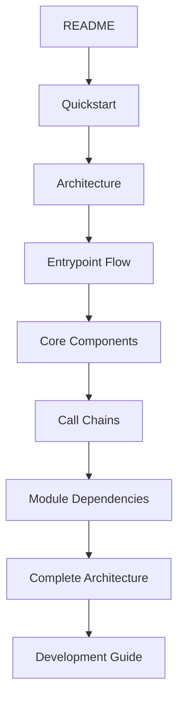

# 01 - 项目概览

## 项目简介

Slurm Bridge 是一个 Kubernetes 调度器，它允许 Slurm（HPC 工作负载管理器）��为 Kubernetes 调度器工作，实现传统 HPC 工作负载和云原生工作负载在同一 Kubernetes 集群中的协同部署。这是一个由 SchedMD LLC 开发的 Slinky 项目。

## 目录结构与主要职责

| 目录 | 主要职责 | 关键文件 |
|------|----------|----------|
| `cmd/` | 应用程序入口点 | `cmd/scheduler/main.go`<br>`cmd/admission/main.go`<br>`cmd/controllers/main.go` |
| `internal/scheduler/plugins/slurmbridge/` | 核心 Slurm Bridge 插件逻辑，Kubernetes 和 Slurm 调度桥接 | `internal/scheduler/plugins/slurmbridge/scheduler.go`<br>`internal/scheduler/plugins/slurmbridge/plugins.go` |
| `internal/admission/` | Webhook 验证和变更逻辑 | `internal/admission/webhook.go`<br>`internal/admission/mutator.go` |
| `internal/controller/` | Kubernetes 控制器实现 | `internal/controller/controller.go`<br>`internal/controller/job_controller.go` |
| `internal/config/` | 配置管理 | `internal/config/config.go`<br>`internal/config/defaults.go` |
| `internal/utils/` | 工具函数 | `internal/utils/utils.go`<br>`internal/utils/logging.go` |
| `config/` | Kubernetes 清单和 RBAC 配置 | `config/crd/bases/`<br>`config/rbac/` |
| `helm/` | Helm 图表部署包 | `helm/slurm-bridge/Chart.yaml`<br>`helm/slurm-bridge/values.yaml` |
| `docs/` | 项目文档 | `docs/architecture.md`<br>`docs/quickstart.md` |

## 构建/运行方式

### 构建方式

#### 使用 Makefile（推荐）
```bash
# 安装开发依赖
make install-dev

# 格式化代码
make fmt

# 代码检查
make vet

# 运行测试（需要 70% 覆盖率）
make test

# 构建 OCI 包含镜像和图表
make build

# 单独构建镜像
make build-images

# 单独构建图表
make build-chart

# 运行代码检查和修复
make golangci-lint

# 安全漏洞检查
make govulncheck
```

#### 使用 Go 原生构建
```bash
# 构建 scheduler 组件
go build -o bin/scheduler cmd/scheduler/main.go

# 构建 admission webhook
go build -o bin/admission cmd/admission/main.go

# 构建 controllers
go build -o bin/controllers cmd/controllers/main.go
```

#### 使用 Docker
```bash
# 构建多架构镜像（linux/amd64, linux/arm64）
make build-images

# 推送到镜像仓库
make push

# 清理构建文件
make clean
```

### 运行方式

#### 本地开发运行
```bash
# 直接运行各个组件
go run cmd/scheduler/main.go
go run cmd/admission/main.go
go run cmd/controllers/main.go

# 在 Kubernetes 环境中运行
kubectl apply -f config/crd/bases/
kubectl apply -f config/rbac/
kubectl apply -f helm/slurm-bridge/
```

#### 使用 Helm 部署
```bash
# 更新图表依赖
make helm-dependency-update

# 验证图表
make helm-validate

# 生成图��文档
make helm-docs

# 部署到集群
helm install slurm-bridge ./helm/slurm-bridge/
```

## 外部依赖

### 核心框架和库
- **Go 1.24.0+** - 主要编程语言，使用现代工具链
- **Kubernetes v1.34+** - 容器编排平台，通过 controller-runtime 集成
  - `k8s.io/api` - Kubernetes API 定义
  - `k8s.io/apimachinery` - Kubernetes 对象模型
  - `k8s.io/client-go` - Kubernetes Go 客户端
  - `k8s.io/kube-scheduler` - Kubernetes 调度器框架
  - `sigs.k8s.io/controller-runtime` - 控制器运行时
- **Slurm v25.05+** - HPC 工作负载管理器
  - `github.com/SlinkyProject/slurm-client v0.4.1` - Slurm 客户端库

### 测试框架
- **Ginkgo/Gomega** - BDD 测试框架
  - `github.com/onsi/ginkgo/v2` - 测试框架
  - `github.com/onsi/gomega` - 断言库

### 工具链
- **Docker** - 容器构建和运行
- **Helm** - Kubernetes 包管理器
- **Kind** - 本地 Kubernetes 集群测试
- **golangci-lint** - Go 代码静态分析工具
- **govulncheck** - Go 安全漏洞检查工具

### Kubernetes 生态组件
- **JobSet** - Kubernetes 作业管理
- **Lightweight Workloads Scheduler (LWS)** - 轻量级工作负载调度
- **Scheduler Plugins** - Kubernetes 调度器插件

## 建议的新手阅读顺序

### 1. 基础概念理解
1. **[README.md](../../README.md)** - 项目概述和快速开始
2. **[docs/quickstart.md](../../docs/quickstart.md)** - 安装和入门指南
3. **[docs/architecture.md](../../docs/architecture.md)** - 系统架构详细说明

### 2. 核心组件理解
4. **[02-entrypoint.md](02-entrypoint.md)** - 程序入口和启动流程
5. **[cmd/scheduler/main.go](../../cmd/scheduler/main.go)** - 调度器入口点
6. **[cmd/admission/main.go](../../cmd/admission/main.go)** - 准入控制器入口点

### 3. 深入理解核心逻辑
7. **[internal/scheduler/plugins/slurmbridge/](../../internal/scheduler/plugins/slurmbridge/)** - 核心插件实现
8. **[internal/admission/](../../internal/admission/)** - Webhook 实现
9. **[internal/controller/](../../internal/controller/)** - 控制器实现

### 4. 工作流程理解
10. **[03-callchains.md](03-callchains.md)** - 核心调用链和序列图
11. **[docs/workload.md](../../docs/workload.md)** - 不同工作负载类型的使用
12. **[docs/scheduler.md](../../docs/scheduler.md)** - 调度器配置

### 5. 模块依赖和数据流
13. **[04-modules.md](04-modules.md)** - 模块依赖和数据流
14. **[05-architecture.md](05-architecture.md)** - 完整系统架构

### 6. 开发和运维指南
15. **[Makefile](../../Makefile)** - 构建和开发命令
16. **[docs/testing.md](../../docs/testing.md)** - 测试指南
17. **[helm/](../../helm/)** - Helm 图表配置

### 推荐阅读路径图


### 关键学习要点
- **Slurm Bridge** 的核心价值在于将传统 HPC 工作负载与云原生工作负载统一管理
- 学习重点：插件机制、Webhook 处理、调度器集成、Slurm API 交互
- 实践建议：先在本地使用 Kind 创建测试集群，然后逐步理解各个组件的交互机制