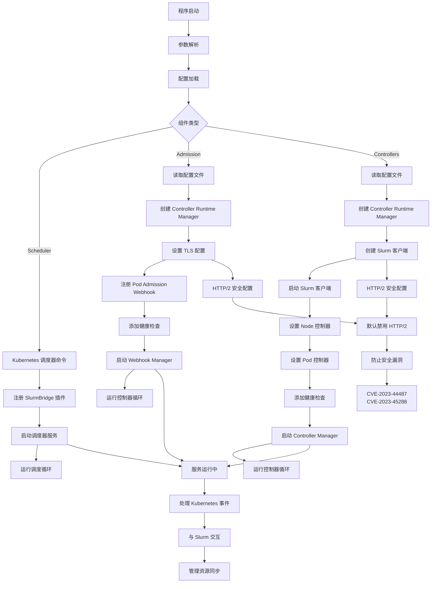

# 02 - 程序入口与启动流程

## 入口函数文件

Slurm Bridge 项目包含三个主要组件，每个组件都有自己的入口函数：

### 1. Scheduler 调度器
**文件**: [`cmd/scheduler/main.go`](../../cmd/scheduler/main.go:20)

```go
func main() {
    // 注册自定义插件到调度器框架
    command := app.NewSchedulerCommand(
        app.WithPlugin(slurmbridge.Name, slurmbridge.New),
    )
    code := cli.Run(command)
    os.Exit(code)
}
```

**功能**:
- 使用 Kubernetes 原生调度器框架
- 注册 Slurm Bridge 插件
- 基于 `k8s.io/component-base/cli` CLI 框架

### 2. Admission Webhook
**文件**: [`cmd/admission/main.go`](../../cmd/admission/main.go:70)

```go
func main() {
    var flags Flags
    opts := zap.Options{}
    opts.BindFlags(flag.CommandLine)
    parseFlags(&flags)
    ctrl.SetLogger(zap.New(zap.UseFlagOptions(&opts)))

    // 读取配置文件
    data, err := os.ReadFile(flags.configFile)
    cfg := config.UnmarshalOrDie(data)

    // 创建 controller-runtime Manager
    mgr, err := ctrl.NewManager(ctrl.GetConfigOrDie(), ctrl.Options{...})

    // 设置 Webhook
    podAdmission := admission.PodAdmission{...}
    if err := podAdmission.SetupWebhookWithManager(mgr); err != nil {
        os.Exit(1)
    }

    // 启动 Manager
    if err := mgr.Start(ctrl.SetupSignalHandler()); err != nil {
        os.Exit(1)
    }
}
```

**功能**:
- 运行 Kubernetes Admission Webhook
- 处理 Pod 的验证和变更
- 基于 `sigs.k8s.io/controller-runtime` 框架

### 3. Controllers 控制器
**文件**: [`cmd/controllers/main.go`](../../cmd/controllers/main.go:75)

```go
func main() {
    var flags Flags
    opts := zap.Options{}
    opts.BindFlags(flag.CommandLine)
    parseFlags(&flags)
    ctrl.SetLogger(zap.New(zap.UseFlagOptions(&opts)))

    // 创建 controller-runtime Manager
    mgr, err := ctrl.NewManager(ctrl.GetConfigOrDie(), ctrl.Options{...})

    // 创建 Slurm 客户端
    clientConfig := &slurmclient.Config{
        Server: cfg.SlurmRestApi,
        AuthToken: func() string {
            token, _ := os.LookupEnv("SLURM_JWT")
            return token
        }(),
    }
    slurmClient, err := slurmclient.NewClient(clientConfig)
    go slurmClient.Start(context.Background())

    // 设置控制器
    if err = (&node.NodeReconciler{...}).SetupWithManager(mgr); err != nil {
        os.Exit(1)
    }
    if err = (&pod.PodReconciler{...}).SetupWithManager(mgr); err != nil {
        os.Exit(1)
    }

    // 启动 Manager
    if err := mgr.Start(ctrl.SetupSignalHandler()); err != nil {
        os.Exit(1)
    }
}
```

**功能**:
- 运行 Kubernetes 控制器
- 管理 Node 和 Pod 资源与 Slurm 的同步
- 基于 `sigs.k8s.io/controller-runtime` 框架

## CLI 框架分析

### 使用的框架
1. **k8s.io/component-base/cli** - Kubernetes 组件基础 CLI 框架
2. **flag** - Go 标准库命令行参数解析
3. **自定义 Flag 结构** - 统一的命令行参数定义

### 命令行参数

#### 共同参数（Admission 和 Controllers）
| 参数 | 默认值 | 说明 |
|------|--------|------|
| `--config` | `/etc/slurm-bridge/config.yaml` | 配置文件路径 |
| `--metrics-bind-address` | `:8080` | 指标服务绑定地址 |
| `--health-probe-bind-address` | `:8081` | 健康检查绑定地址 |
| `--leader-elect` | `false` | 是否启用领导者选举 |
| `--metrics-secure` | `false` | 是否安全暴露指标 |
| `--enable-http2` | `false` | 是否启用 HTTP/2 |

#### 特定参数
- **Scheduler**: 无额外参数，使用 Kubernetes 调度器默认参数
- **Admission**: `--enable-http2` 用于控制 HTTP/2 支持

## 服务框架识别

### 1. Controller Runtime 框架
- **Admission Webhook** 和 **Controllers** 都使用 `sigs.k8s.io/controller-runtime`
- 提供统一的控制器管理、Webhook 服务、健康检查等功能

### 2. Kubernetes 调度器框架
- **Scheduler** 使用 `k8s.io/kubernetes/cmd/kube-scheduler/app`
- 插件机制支持自定义调度逻辑

### 3. HTTP 服务
- **Metrics Server**: 监控指标暴露（Prometheus 格式）
- **Health Check Server**: 健康检查和就绪检查
- **Webhook Server**: Admission Webhook HTTP 服务

### 4. TLS 配置
- 支持自定义 TLS 配置
- 默认禁用 HTTP/2 以安全漏洞
- 支持 HTTP/1.1 和可选的 HTTP/2

## 启动流程图



## 启动顺序详解

### 1. 配置加载阶段
- **配置文件路径**: `/etc/slurm-bridge/config.yaml`（可自定义）
- **配置结构**: 包含 Slurm REST API、调度器名称、管理命名空间等信息
- **错误处理**: 配置文件读取失败时程序退出

### 2. 依赖初始化阶段
- **Kubernetes 客户端**: 通过 `ctrl.GetConfigOrDie()` 获取集群配置
- **Scheme 注册**: 注册 Kubernetes API scheme（Pod、Node 等）
- **Slurm 客户端**: 创建与 Slurm REST API 的连接
- **TLS 配置**: 安全的 HTTP 服务配置

### 3. 路由/命令注册阶段
- **Scheduler**: 注册 `slurmbridge` 插件到调度器框架
- **Admission**: 注册 Pod Webhook（变更 + 验证）
- **Controllers**: 注册 Node 和 Pod 控制器
- **健康检查**: 注册 `healthz` 和 `readyz` 端点

### 4. 服务启动阶段
- **Manager 启动**: 使用 `ctrl.SetupSignalHandler()` 处理信号
- **并发启动**: Slurm 客户端在后台启动
- **服务就绪**: 健康检查端点提供服务状态
- **事件处理**: 开始监听 Kubernetes 事件并处理

## 关键启动特性

### 安全特性
- **HTTP/2 默认禁用**: 防止 Stream Cancellation 和 Rapid Reset CVEs
- **TLS 支持**: 支持自定义 TLS 配置
- **认证集成**: 支持 Kubernetes 各种认证方式

### 可靠性特性
- **领导者选举**: 支持多实例部署
- **健康检查**: 提供 liveness 和 readiness 检查
- **优雅关闭**: 通过信号处理实现优雅关闭

### 监控特性
- **指标暴露**: Prometheus 格式的监控指标
- **日志记录**: 结构化日志支持
- **事件追踪**: 关键操作的事件记录

启动流程确保了组件的顺序初始化、配置验证、依赖管理和服务注册，为后续的 Kubernetes 事件处理和 Slurm 集成提供稳定的基础。