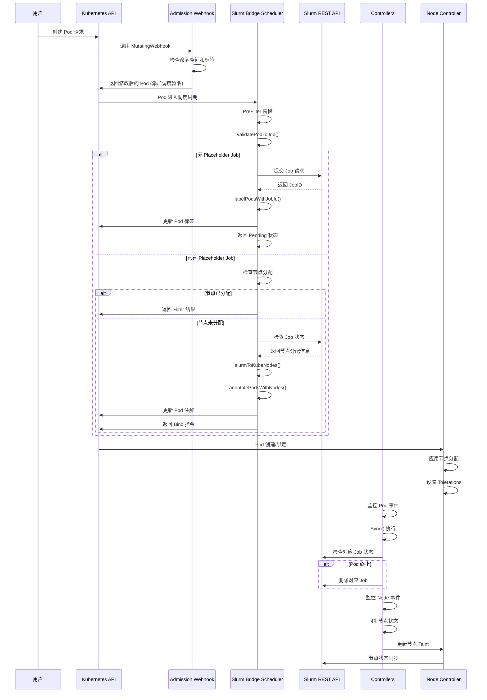

# 03 - 核心调用链

## 函数调用树

### 1. Pod 提交处理链

#### 1.1 Admission Webhook 调用树
```
PodAdmission.Default(ctx, obj)
└── PodAdmission.isManagedNamespace(ctx, namespace)
    ├── client.Get(ctx, namespace, &metav1.LabelSelector) → 检查命名空间标签选择器
    └── slices.Contains(cfg.ManagedNamespaces, namespace) → 检查是否在管理命名空间列表中

PodAdmission.ValidateCreate(ctx, obj)
└── PodAdmission.isManagedNamespace(ctx, namespace) → 同上
    ├── 验证 Pod 是否包含 Slurm 必需标签
    ├── 检查资源配置注解格式
    └── 返回验证结果 (允许/拒绝)
```

**文件路径**: [`internal/admission/admission.go`](../../internal/admission/admission.go:42)

#### 1.2 Slurm Bridge Scheduler 调用树
```
SlurmBridge.PreFilter(ctx, state, pod, nodeInfo)
├── sb.validatePodToJob(ctx, pod)
│   ├── 检查 Pod 是否为 JobSet/PodGroup/LWS 等根对象
│   └── 验证必需的 Slurm 标签和注解
├── 检查现有 Placeholder Job 注解
│   ├── pod.Labels[wellknown.LabelPlaceholderJobId] → 检查 JobID
│   └── pod.Annotations[wellknown.AnnotationPlaceholderNode] → 检查节点分配
├── slurmjobir.TranslateToSlurmJobIR(sb.Client, ctx, pod)
│   ├── 解析 Pod 资源需求 (CPU, Memory, GPU)
│   ├── 构建 SlurmJobIR 结构
│   └── 处理不同类型的根对象 (JobSet, PodGroup, Job, Pod, LWS)
└── sb.slurmControl.GetJob(ctx, pod)
    ├── 查询 Slurm API 获取 Job 状态
    └── 返回 PlaceholderJob 对象
```

**文件路径**: [`internal/scheduler/plugins/slurmbridge/slurmbridge.go`](../../internal/scheduler/plugins/slurmbridge/slurmbridge.go:127)

### 2. Slurm 作业创建链

#### 2.1 Job 提交调用树
```
sb.slurmControl.SubmitJob(ctx, pod, slurmJobIR)
├── slurmcontrol.submitJob(ctx, pod, slurmJobIR, update)
│   ├── 构建 JobSubmitRequest 对象
│   ├── 设置 AdminComment 为 Pod 信息
│   ├── 设置节点数量和资源配置
│   ├── 调用 slurmClient.SubmitJob()
│   └── 返回 JobID
└── sb.labelPodsWithJobId(ctx, jobid, slurmJobIR)
    ├── 遍历 slurmJobIR.Pods 列表
    ├── 为每个 Pod 添加 JobID 标签
    ├── 添加 Finalizer 防止意外删除
    └── 通过 Patch 更新 Pod 对象
```

**文件路径**: [`internal/scheduler/plugins/slurmbridge/slurmcontrol/slurmcontrol.go`](../../internal/scheduler/plugins/slurmbridge/slurmcontrol/slurmcontrol.go:128)

### 3. Pod 节点分配链

#### 3.1 Filter 阶段调用树
```
SlurmBridge.Filter(ctx, state, pod, nodeInfo)
├── 检查 Pod 是否已有节点分配
│   ├── pod.Annotations[wellknown.AnnotationPlaceholderNode] → 查看分配状态
│   └── 如果已分配则只允许在该节点运行
└── sb.slurmToKubeNodes(ctx, slurmNodes)
    ├── hostlist.Expand(placeholderJob.Nodes) → 展开 Slurm 节点列表
    ├── 遍历转换节点名称 (slurm-node-0 → k8s-node-0)
    └── 返回 Kubernetes 节点名称集合
```

**文件路径**: [`internal/scheduler/plugins/slurmbridge/slurmbridge.go`](../../internal/scheduler/plugins/slurmbridge/slurmbridge.go:127)

### 4. Controller 同步链

#### 4.1 Pod Controller 调用树
```
PodReconciler.Sync(ctx, req)
├── r.syncKubernetes(ctx, req)
│   ├── 获取 Pod 对象
│   ├── 检查是否为 Slurm Bridge 调度的 Pod
│   ├── 检查 Pod 是否正在运行
│   ├── r.slurmControl.IsJobRunning(ctx, pod) → 检查对应 Slurm Job
│   └── 如果 Job 不存在则删除 Pod
├── r.syncSlurm(ctx, req)
│   ├── 获取 Pod 对象
│   ├── r.slurmControl.IsJobRunning(ctx, pod) → 检查 Job 状态
│   ├── 如果 Pod 已终止则删除对应 Slurm Job
│   └── 如果 Pod 正在运行则检查 Job 状态
└── r.deleteFinalizer(ctx, req)
    └── 移除 Pod 的 finalizer，允许删除
```

**文件路径**: [`internal/controller/pod/pod_sync.go`](../../internal/controller/pod/pod_sync.go:23)

#### 4.2 Node Controller 调用树
```
NodeReconciler.Sync(ctx, req)
├── r.syncTaint(ctx, req)
│   ├── 获取 Slurm 节点列表
│   ├── 获取 Kubernetes 节点列表
│   ├── 计算需要桥接的节点
│   ├── r.taintNode() → 添加不可调度 Taint
│   └── r.untaintNode() → 移除 Taint
└── r.syncState(ctx, req)
    ├── 检查节点调度状态
    ├── 如果节点不可调度 → Drain Slurm 节点
    └── 如果节点可调度 → Undrain Slurm 节点
```

**文件路径**: [`internal/controller/node/node_sync.go`](../../internal/controller/node/node_sync.go:25)

### 5. 错误处理分支

#### 5.1 关键错误处理点
```
SlurmBridge.PreFilter(ctx, state, pod, nodeInfo)
├── validatePodToJob 失败 → fwk.NewStatus(fwk.Error, err.Error())
├── slurmControl.GetJob 失败 → fwk.NewStatus(fwk.Error, err.Error())
├── PlaceholderJob 无效 → 删除 Job + fwk.NewStatus(fwk.Error)
├── SubmitJob 失败 → 根据错误类型返回不同状态
│   ├── ErrorNodeConfigInvalid → fwk.UnschedulableAndUnresolvable
│   ├── 其他错误 → fwk.Error
└── annotatePodsWithNodes 失败 → ErrorPodUpdateFailed / ErrorNoKubeNode
```

**文件路径**: [`internal/scheduler/plugins/slurmbridge/slurmbridge.go`](../../internal/scheduler/plugins/slurmbridge/slurmbridge.go:127)

## 关键函数说明

### 调度器核心函数
| 函数名 | 作用 | 关键分支 |
|--------|------|----------|
| `PreFilter()` | 创建/更新 Placeholder Job，等待 Slurm 分配 | ✓ 需求验证<br>✓ 作业状态检查<br>✓ 错误重试 |
| `validatePodToJob()` | 验证 Pod 是否符合 Slurm Job 要求 | ✓ 标签检查<br>✓ 注解格式验证 |
| `slurmToKubeNodes()` | 将 Slurm 节点名转换为 Kubernetes 节点名 | ✓ 名称映射<br>✓ 集合转换 |
| `labelPodsWithJobId()` | 为 Pod 添加 JobID 标签和 Finalizer | ✓ 批量更新<br>✓ Finalizer 管理 |
| `annotatePodsWithNodes()` | 为 Pod 分配具体节点 | ✓ 节点选择<br>✓ Tolerance 添加 |

### Controller 核心函数
| 函数名 | 作用 | 关键分支 |
|--------|------|----------|
| `Sync()` | 协调 Kubernetes 和 Slurm 状态 | ✓ 双向同步<br>✓ 错误聚合 |
| `syncKubernetes()` | 删除没有对应 Job 的 Pod | ✓ Pod 状态检查<br>✓ Job 存在验证 |
| `syncSlurm()` | 删除对应已终止 Pod 的 Job | ✓ Pod 终止检测<br>✓ Job 删除 |
| `syncTaint()` | 同步节点 Taint 状态 | ✓ 节点状态计算<br>✓ Taint 应用/移除 |

## 并发和中间件

### 并发处理
1. **Slurm 客户端并发启动** (`cmd/controllers/main.go:134`)
   ```go
   go slurmClient.Start(context.Background())
   ```

2. **多个控制器并发运行**
   - Node Controller 和 Pod Controller 同时运行
   - 通过 Event Channel 处理事件

3. **Pod 并发调度**
   - 多个 Pod 可以同时进行 PreFilter 处理
   - 通过 CycleState 保证状态一致性

### 中间件和处理链
1. **Kubernetes 调度器框架**
   ```mermaid
   graph LR
   A[Pod 提交] --> B[Queue 阶段]
   B --> C[PreFilter 阶段]
   C --> D[Filter 阶段]
   D --> E[Score 阶段]
   E --> F[Bind 阶段]
   ```

2. **Controller Runtime 处理链**
   ```mermaid
   graph LR
   A[事件发生] --> B[事件队列]
   B --> C[Reconcile 请求]
   C --> D[Manager 分发]
   D --> E[Controller 处理]
   ```

## Mermaid 时序图：主干调用链



## 关键调用链总结

### 1. Pod 生命周期链
```
Pod 创建 → Admission Webhook → Slurm Bridge Scheduler → Slurm Job 创建 → Pod 绑定 → Controller 监控
```

### 2. 双向同步链
```
Pod 终止 → Controller 检测 → Slurm Job 删除
Pod 异常 → Controller 检测 → Kubernetes Pod 删除
节点状态变化 → Node Controller → Slurm 节点状态同步
```

### 3. 错误恢复链
```
调度失败 → 重试机制 → 最终失败标记
节点分配失败 → 状态回滚 → 重试调度
API 连接失败 → 重试机制 → 最终失败
```

这个架构实现了 Kubernetes 和 Slurm 的深度融合，通过 Placeholder Job 机制实现了资源预留和分配，通过 Controller 模式实现了状态同步，确保了两个系统的一致性。