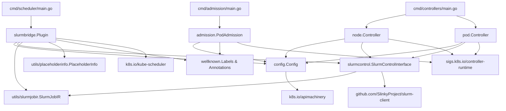
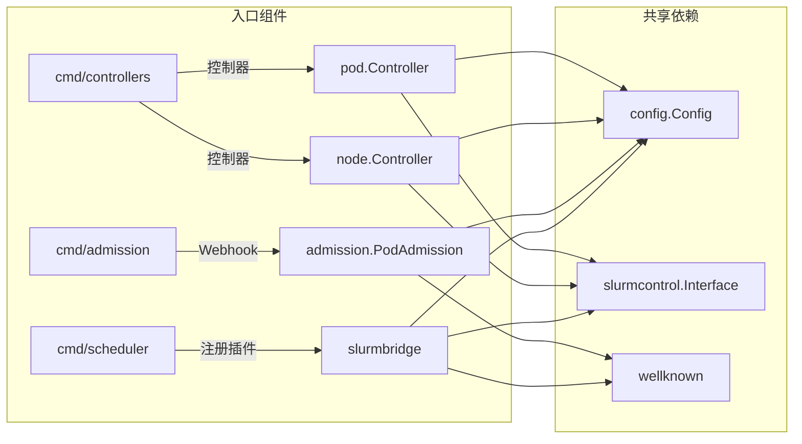
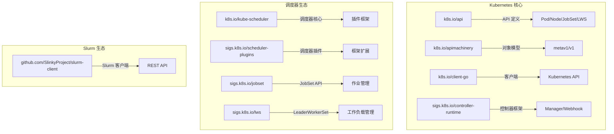
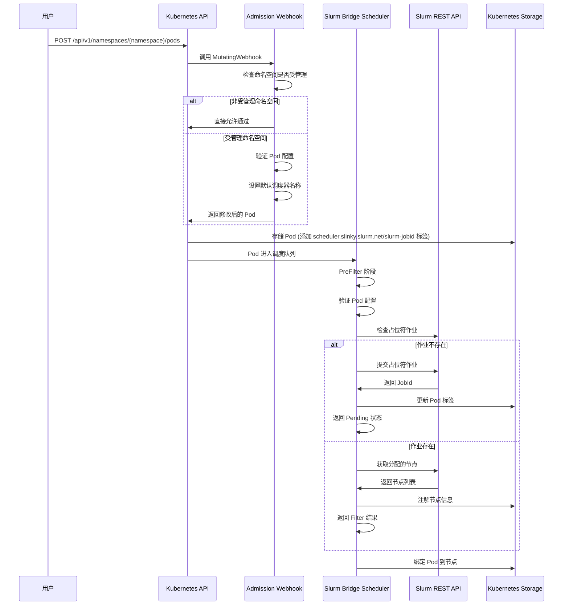
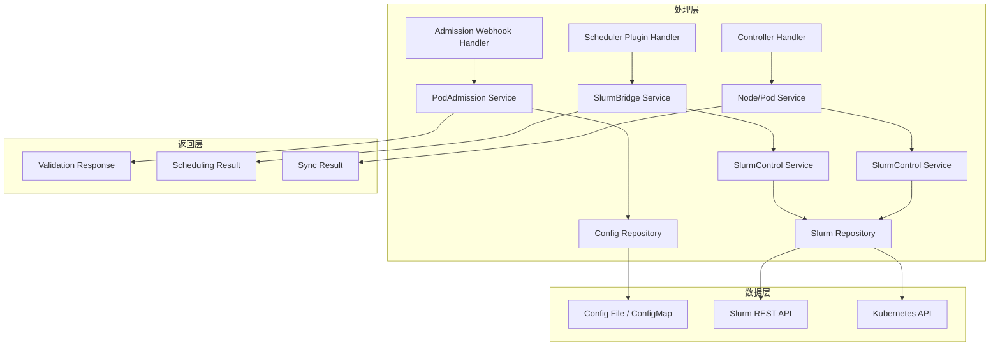
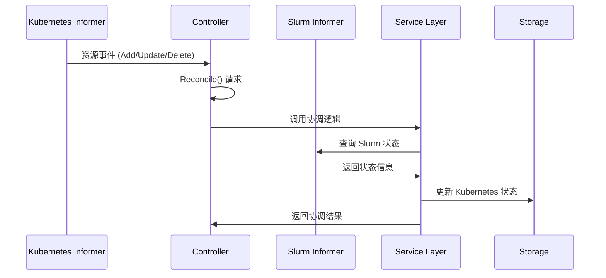
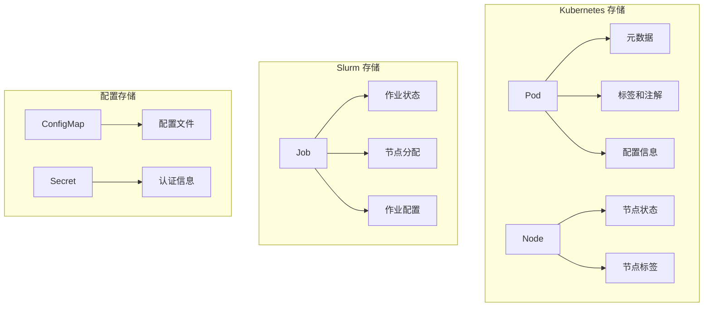

# 04 - 模块依赖与数据流

## 模块依赖关系

### 1. 核心模块依赖图



### 2. 组件间依赖分析

#### 2.1 cmd/ 组件独立性


### 3. 外部依赖层次

#### 3.1 Kubernetes 生态依赖


## 重要数据结构

### 1. 配置管理结构

#### Config 结构体
```go
// 文件: internal/config/config.go
type Config struct {
    SchedulerName            string                // 调度器名称，用于识别 Slurm Bridge 调度器
    SlurmRestApi             string                // Slurm REST API 服务地址
    ManagedNamespaces        []string              // 需要管理的 Kubernetes 命名空间列表
    ManagedNamespaceSelector *metav1.LabelSelector // 命名空间选择器，用于动态选择命名空间
    MCSLabel                 string                // 多类别安全标签
    Partition                string                // Slurm 分区名称
}
```

### 2. Slurm 作业中间表示

#### SlurmJobIR 结构体
```go
// 文件: internal/utils/slurmjobir/slurmjobir.go
type SlurmJobIR struct {
    RootPOM metav1.PartialObjectMetadata  // 根对象元数据（JobSet/PodGroup/LWS/Job/Pod）
    Pods    corev1.PodList                 // 包含的所有 Pod 列表
    JobInfo SlurmJobIRJobInfo              // 作业配置信息
}

type SlurmJobIRJobInfo struct {
    Account      *string  // 账户
    CpuPerTask   *int32   // 每任务 CPU
    Constraints  *string  // 约束条件
    Gres         *string  // GPU 资源
    GroupId      *string  // 组 ID
    JobName      *string  // 作业名称
    Licenses     *string  // 许可证
    MemPerNode   *int64   // 每节点内存（MB）
    MinNodes     *int32   // 最小节点数
    MaxNodes     *int32   // 最大节点数
    Partition    *string  // Slurm 分区
    QOS          *string  // 服务质量
    Reservation  *string  // 预留
    TasksPerNode *int32   // 每节点任务数
    TimeLimit    *int32   // 时间限制（分钟）
    UserId       *string  // 用户 ID
    Wckey        *string  // 工作密钥
}
```

### 3. Slurm 控制接口

#### SlurmControlInterface（调度器用）
```go
// 文件: internal/scheduler/plugins/slurmbridge/slurmcontrol/slurmcontrol.go
type SlurmControlInterface interface {
    DeleteJob(ctx context.Context, pod *corev1.Pod) error                      // 删除 Slurm 作业
    GetJobsForPods(ctx context.Context) (*map[string]PlaceholderJob, error)    // 获取所有 Pod 对应的作业
    GetJob(ctx context.Context, pod *corev1.Pod) (*PlaceholderJob, error)      // 获取单个作业
    SubmitJob(ctx context.Context, pod *corev1.Pod, slurmJobIR *SlurmJobIR) (int32, error) // 提交作业
    UpdateJob(ctx context.Context, pod *corev1.Pod, slurmJobIR *SlurmJobIR) (int32, error) // 更新作业
}

type PlaceholderJob struct {
    JobId int32  // Slurm 作业 ID
    Nodes string // 分配的节点列表
}
```

#### SlurmControlInterface（控制器用）
```go
// 文件: internal/controller/node/slurmcontrol/slurmcontrol.go
type SlurmControlInterface interface {
    GetNodeNames(ctx context.Context) ([]string, error)                        // 获取所有节点名称
    MakeNodeDrain(ctx context.Context, node *corev1.Node, reason string) error    // 设置节点为 DRAIN 状态
    MakeNodeUndrain(ctx context.Context, node *corev1.Node, reason string) error  // 设置节点为 UNDRAIN 状态
    IsNodeDrain(ctx context.Context, node *corev1.Node) (bool, error)           // 检查节点是否为 DRAIN 状态
}
```

### 4. 控制器结构体

#### NodeReconciler 结构体
```go
// 文件: internal/controller/node/node_controller.go
type NodeReconciler struct {
    client.Client                         // Kubernetes 客户端
    Scheme        *runtime.Scheme          // Kubernetes scheme
    SchedulerName string                   // 调度器名称
    SlurmClient   slurmclient.Client      // Slurm 客户端
    EventCh       chan event.GenericEvent  // 事件通道
    slurmControl  slurmcontrol.SlurmControlInterface // Slurm 控制接口
    eventRecorder record.EventRecorderLogger // 事件记录器
}
```

#### PodReconciler 结构体
```go
// 文件: internal/controller/pod/pod_controller.go
type PodReconciler struct {
    client.Client                         // Kubernetes 客户端
    Scheme        *runtime.Scheme          // Kubernetes scheme
    SchedulerName string                   // 调度器名称
    SlurmClient   slurmclient.Client      // Slurm 客户端
    EventCh       chan event.GenericEvent  // 事件通道
    slurmControl  slurmcontrol.SlurmControlInterface // Slurm 控制接口
    eventRecorder record.EventRecorderLogger // 事件记录器
}
```

### 5. 插件结构体

#### SlurmBridge 结构体
```go
// 文件: internal/scheduler/plugins/slurmbridge/slurmbridge.go
type SlurmBridge struct {
    client.Client                         // Kubernetes 客户端
    schedulerName string                   // 调度器名称
    slurmControl  slurmcontrol.SlurmControlInterface // Slurm 控制接口
    handle        framework.Handle          // 调度器句柄
}
```

### 6. Webhook 结构体

#### PodAdmission 结构体
```go
// 文件: internal/admission/admission.go
type PodAdmission struct {
    client.Client                         // Kubernetes 客户端
    SchedulerName            string        // 调度器名称
    ManagedNamespaces        []string      // 管理的命名空间列表
    ManagedNamespaceSelector *metav1.LabelSelector // 命名空间选择器
}
```

## 典型请求处理流程

### 1. Pod 提交处理流程

#### 输入：Pod 创建请求


#### 处理层：Handler → Service → Repo


### 2. Controller 同步流程

#### 输入：事件监听


## API 接口表格

### 1. Kubernetes API 调用

| 路径 | 方法 | 入参 | 出参 | 中间件 |
|------|------|------|------|--------|
| `/api/v1/namespaces/{namespace}/pods` | POST | Pod 对象 | AdmissionReview | Validation, Mutation |
| `/api/v1/namespaces/{namespace}/pods/{name}` | GET | Pod 名称 | Pod 对象 | Authorization, Metrics |
| `/api/v1/namespaces/{namespace}/nodes/{name}` | GET | Node 名称 | Node 对象 | Authorization, Metrics |
| `/apis/slinky.slurm.net/v1/placeholderjobs` | LIST | ListOptions | PlaceholderJobList | Authorization |
| `/apis/jobset.x-k8s.io/v1alpha2/jobsets` | LIST | ListOptions | JobSetList | Authorization |
| `/apis/lws.x-k8s.io/v1alpha1/leaderworkersets` | LIST | ListOptions | LWSList | Authorization |

### 2. Slurm REST API 调用

| 路径 | 方法 | 入参 | 出参 | 中间件 |
|------|------|------|------|--------|
| `/slurm/v00437/job/` | POST | JobSubmitRequest | JobId | Authentication |
| `/slurm/v00437/job/{jobid}` | GET | JobId | JobInfo | Authentication |
| `/slurm/v00437/job/{jobid}` | PUT | JobUpdateRequest | JobId | Authentication |
| `/slurm/v00437/job/{jobid}` | DELETE | JobId | Success | Authentication |
| `/slurm/v00437/node/` | GET | 无 | NodeList | Authentication |
| `/slurm/v00437/node/{nodename}` | PUT | DrainRequest | Success | Authentication |

### 3. Controller Runtime API

| 接口 | 方法 | 入参 | 出参 | 用途 |
|------|------|------|------|------|
| `NewManager()` | 构造函数 | ManagerOptions | Manager | 创建控制器管理器 |
| `Watch()` | 监听器 | Source, Handler | Watch | 监听资源变化 |
| `Reconcile()` | 协调器 | Request, Reconciler | Result | 执行协调逻辑 |
| `SetupWebhookWithManager()` | Webhook设置 | Webhook, Manager | Webhook | 设置 Admission Webhook |
| `AddHealthzCheck()` | 健康检查 | Name, Check | Status | 添加健康检查端点 |
| `AddReadyzCheck()` | 就绪检查 | Name, Check | Status | 添加就绪检查端点 |

### 4. 内部服务 API

| 服务接口 | 方法 | 入参 | 出参 | 用途 |
|----------|------|------|------|------|
| `PodAdmission.Default()` | 默认值设置 | Context, Pod | AdmissionResponse | 设置默认调度器名称 |
| `PodAdmission.ValidateCreate()` | 创建验证 | Context, Pod | AdmissionResponse | 验证 Pod 创建请求 |
| `SlurmBridge.PreFilter()` | 调度预处理 | Context, State, Pod, NodeInfo | PreFilterResult | 预处理调度决策 |
| `SlurmBridge.Filter()` | 调度过滤 | Context, State, Pod, NodeInfo | FilterResult | 过滤可用节点 |
| `NodeReconciler.Sync()` | 节点同步 | Context, Request | Error | 同步节点状态 |
| `PodReconciler.Sync()` | Pod 同步 | Context, Request | Error | 同步 Pod 状态 |

## 数据存储和返回

### 1. 存储层


### 2. 返回格式
```go
// Admission Response
type AdmissionResponse struct {
    Allowed bool             // 是否允许
    Patch   []byte           // 补丁操作
    Result  *metav1.Status  // 状态信息
}

// Scheduling Result
type FilterResult struct {
    NodeNames   sets.Set[string]  // 可选节点集合
    Status      *framework.Status // 调度状态
    Reason      string           // 状态原因
}

// Sync Result
type SyncResult struct {
    Status  reconcile.Result // 协调结果
    Error   error           // 错误信息
    Message string          // 消息
}
```

## 总结

Slurm Bridge 采用了清晰的分层架构设计：

1. **模块化设计**：三个独立组件通过接口解耦，便于维护和扩展
2. **数据流清晰**：从 Pod 提交到资源分配的完整链路，每个环节都有明确的职责
3. **接口抽象**：通过 SlurmControlInterface 等接口实现不同组件的统一交互
4. **事件驱动**：基于 Informer 的事件驱动机制，确保状态一致性
5. **配置统一**：通过 Config 结构体统一管理所有组件的配置信息

这种架构设计使得系统能够有效协调 Kubernetes 和 Slurm 两个不同的调度系统，实现传统 HPC 工作负载与云原生工作负载的统一管理。