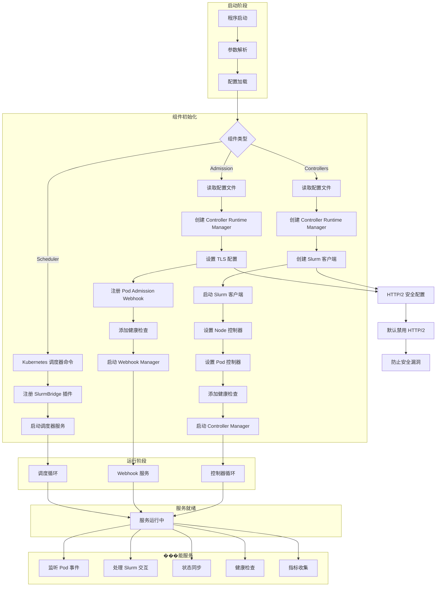
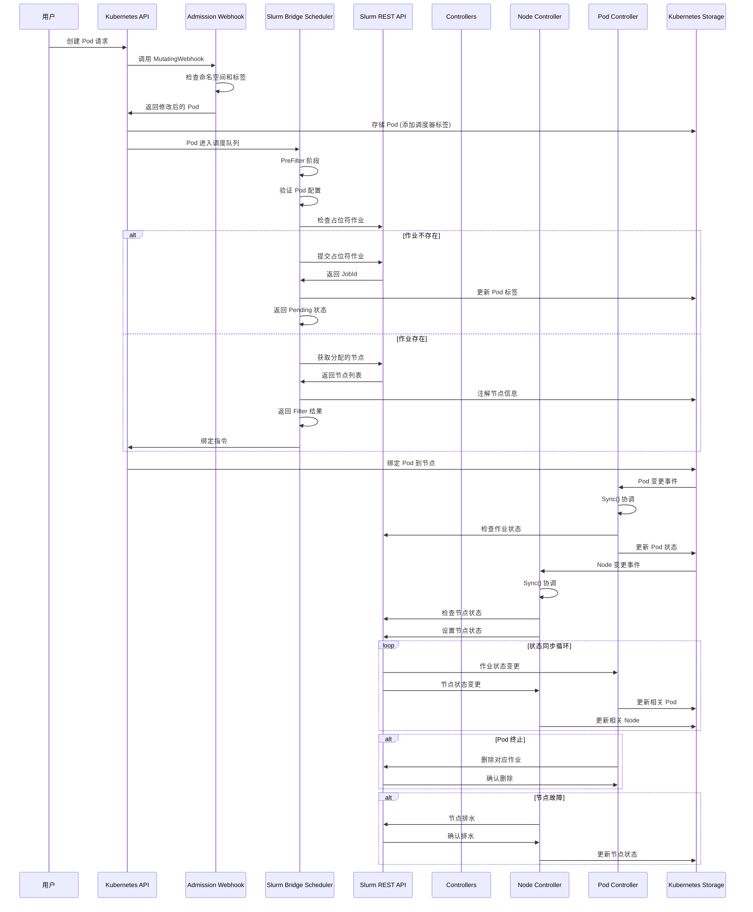
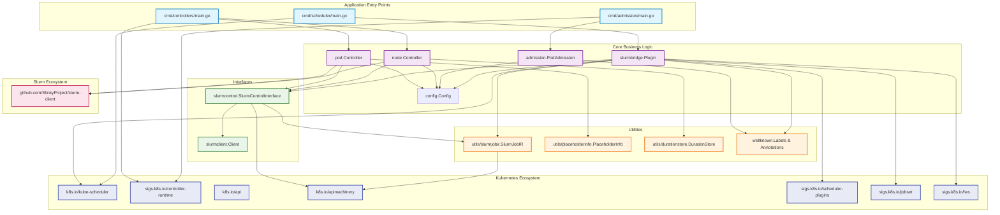
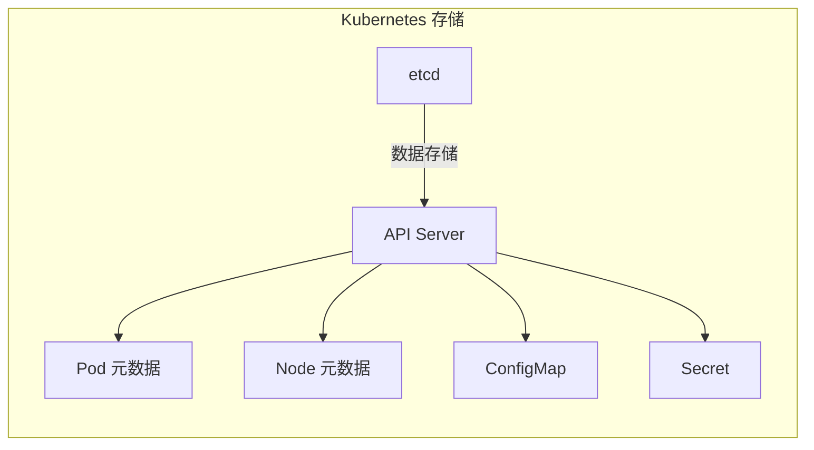
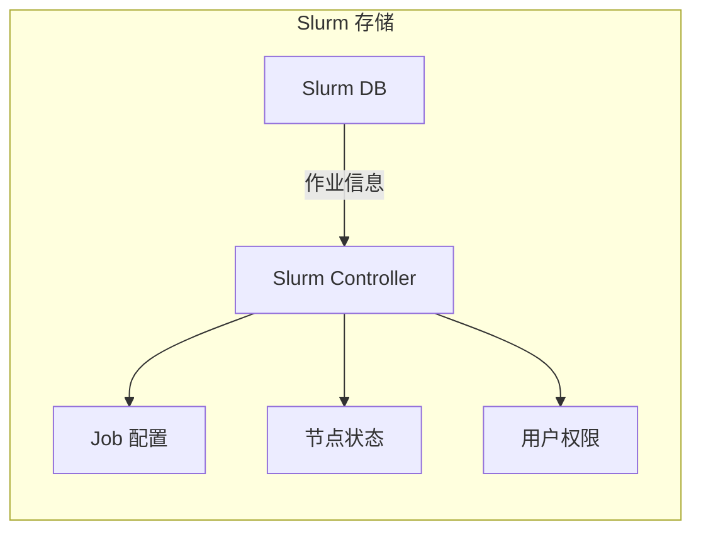
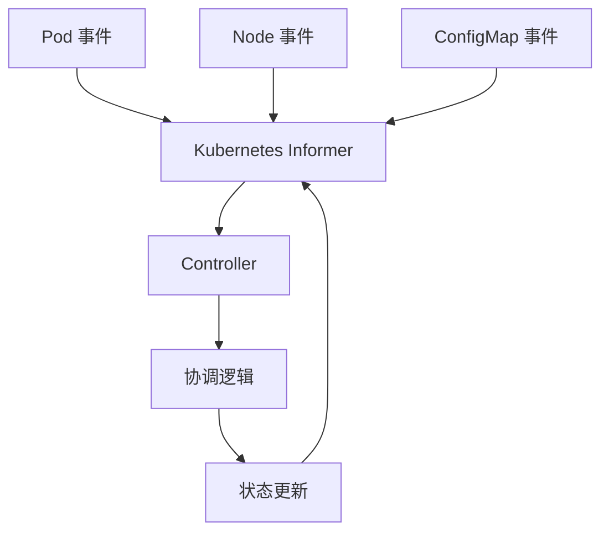
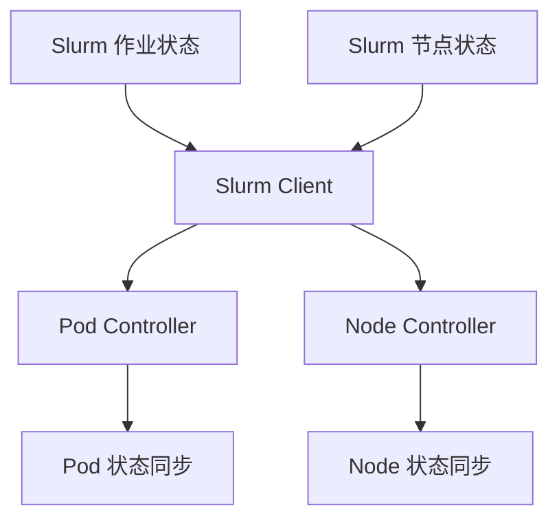

# 05 - 架构文档

## 系统整体架构综述

Slurm Bridge 是一个**双向桥接系统**，实现了 Kubernetes 与 Slurm 两大工作负载管理系统的深度集成。该系统采用**微服务架构**，由三个核心组件构成，通过统一的配置管理和事件驱动机制实现状态同步。

### 架构核心特性

#### 1. 双向桥接机制
- **Kubernetes → Slurm**: Pod 提交时创建 Slurm 占位符作业
- **Slurm → Kubernetes**: 作业状态变化反向同步到 Pod 状态
- **双向状态同步**: 确保两个系统状态的一致性

#### 2. 占位符作业机制
- 通过 Placeholder Job 实现资源预留
- 支持复杂工作负载（JobSet、PodGroup、LWS等）
- 实现了 Kubernetes 调度器与 Slurm 调度器的无缝集成

#### 3. 分层服务架构
- **应用层**: Admission Webhook、Controller、Scheduler
- **逻辑层**: Slurm Bridge 插件、状态管理、同步逻辑
- **接口层**: Kubernetes API、Slurm REST API
- **存储层**: Kubernetes 元数据、Slurm 作业信息

#### 4. 事件驱动架构
- 基于 Kubernetes Informer 的事件监听
- Controller 模式的状态协调机制
- 异步事件处理确保高性能

## 顶层目录表

| 目录 | 作用 | 关键文件 |
|------|------|----------|
| `cmd/` | 应用程序入口点 | `cmd/scheduler/main.go`<br>`cmd/admission/main.go`<br>`cmd/controllers/main.go` |
| `internal/` | 内部应用代码 | |
| &nbsp;&nbsp;`scheduler/plugins/slurmbridge/` | 核心 Slurm Bridge 插件逻辑 | `slurmbridge.go`<br>`slurmcontrol/slurmcontrol.go` |
| &nbsp;&nbsp;`admission/` | Webhook 验证和变更逻辑 | `admission.go` |
| &nbsp;&nbsp;`controller/` | Kubernetes 控制器实现 | `node/node_controller.go`<br>`pod/pod_controller.go` |
| &nbsp;&nbsp;`config/` | 配置管理 | `config.go`<br>`defaults.go` |
| &nbsp;&nbsp;`utils/` | 工具函数 | `slurmjobir/slurmjobir.go`<br>`placeholderinfo/`<br>`durationstore/` |
| &nbsp;&nbsp;`wellknown/` | 常量定义 | `annotations.go`<br>`labels.go`<br>`finalizers.go` |
| `config/` | Kubernetes 清单和 RBAC 配置 | `crd/bases/`<br>`rbac/` |
| `helm/` | Helm 图表部署包 | `slurm-bridge/Chart.yaml`<br>`slurm-bridge/values.yaml` |
| `docs/` | 项目文档 | `architecture.md`<br>`quickstart.md`<br>`workload.md` |
| `hack/` | 构建和开发脚本 | `build-images.sh`<br>`deploy-local.sh` |

## 启动流程图



## 核心调用链时序图



## 模块依赖关系图



## 外部依赖

### 1. 数据库/存储依赖

#### Kubernetes 集群


#### Slurm 数据存储


### 2. API 依赖

#### Kubernetes API
```go
// 核心依赖
- k8s.io/api v0.34.1        // Kubernetes API 定义
- k8s.io/apimachinery v0.34.1 // Kubernetes 基础对象
- k8s.io/client-go v0.34.1  // Kubernetes 客户端
- sigs.k8s.io/controller-runtime v0.22.1 // 控制器运行时
```

#### Slurm REST API
```go
// Slurm REST API 客户端
- github.com/SlinkyProject/slurm-client v0.4.1 // Slurm 客户端库
```

### 3. 消息队列/事件系统

#### Kubernetes 事件系统


#### Slurm 事件系统


### 4. 第三方 API

#### 监控和日志
```go
// 监控依赖
- k8s.io/component-base/metrics/prometheus/clientgo // Prometheus 指标
- k8s.io/klog/v2 // 日志记录

// 工具依赖
- github.com/onsi/ginkgo/v2 v2.25.3 // 测试框架
- github.com/onsi/gomega v1.38.2  // 断言库
```

#### 网络和工具
```go
// 网络工具
- github.com/puttsk/hostlist v0.1.0 // 主机列表处理
- k8s.io/utils v0.0.0-20250820121507-0af2bda4dd1d // 工具库
```

## 配置项

### 1. 主配置文件

#### `/etc/slurm-bridge/config.yaml`
```yaml
# 调度器配置
schedulerName: "slurm-bridge"

# Slurm REST API 配置
slurmRestApi: "http://slurm-controller:6820"

# 管理的命名空间
managedNamespaces:
  - "batch"
  - "hpc"
  - "ai-workloads"

# 命名空间选择器（动态选择命名空间）
managedNamespaceSelector:
  matchLabels:
    slurm.managed: "true"

# 多类别安全标签
mcsLabel: ""

# Slurm 分区
partition: "normal"

# 高级配置
features:
  enableLeaderElection: true
  enableHTTP2: false
  secureMetrics: false
```

### 2. 环境变量配置

#### Slurm 认证
```bash
# Slurm JWT Token
export SLURM_JWT="your-jwt-token-here"

# Slurm REST API 地址
export SLURM_REST_API="http://slurm-controller:6820"
```

#### Kubernetes 认证
```bash
# Kubernetes 集群配置
export KUBECONFIG="/path/to/kubeconfig"

# 命名空间选择
export NAMESPACE_SELECTOR="slurm.managed=true"
```

### 3. 命令行参数配置

#### Scheduler 配置
```bash
# 默认使用 Kubernetes 调度器默认参数
--kubeconfig=/path/to/kubeconfig
--v=2
```

#### Admission Webhook 配置
```bash
# 配置文件
--config=/etc/slurm-bridge/config.yaml

# 服务地址
--metrics-bind-address=:8080
--health-probe-bind-address=:8081

# 领导者选举
--leader-elect=true
--leader-election-id=a1f3cd42.slinky.slurm.net

# 安全配置
--metrics-secure=false
--enable-http2=false
```

#### Controllers 配置
```bash
# 配置文件
--config=/etc/slurm-bridge/config.yaml

# 服务地址
--metrics-bind-address=:8080
--health-probe-bind-address=:8081

# 领导者选举
--leader-elect=true
--leader-election-id=69d5fe47.my.slinky.slurm.net

# 安全配置
--metrics-secure=false
--enable-http2=false
```

### 4. Helm 配置

#### `helm/slurm-bridge/values.yaml`
```yaml
# 部署配置
replicaCount: 3
image:
  repository: slinky.slurm.net/slurm-bridge
  pullPolicy: IfNotPresent
  tag: "1.0.0"

# 资源限制
resources:
  limits:
    cpu: 1
    memory: 1Gi
  requests:
    cpu: 100m
    memory: 128Mi

# 配置
config:
  schedulerName: "slurm-bridge"
  slurmRestApi: "http://slurm-controller:6820"
  managedNamespaces:
    - "batch"
    - "hpc"
    - "ai-workloads"
  managedNamespaceSelector:
    matchLabels:
      slurm.managed: "true"
  mcsLabel: ""
  partition: "normal"

# 服务配置
service:
  type: ClusterIP
  port: 8080

# 安全配置
securityContext:
  runAsUser: 1000
  runAsGroup: 1000
  fsGroup: 1000

# RBAC 配置
rbac:
  create: true
  rules: []
```

### 5. RBAC 配置

#### ClusterRole 和 ClusterRoleBinding
```yaml
# 服务账户权限
apiVersion: v1
kind: ServiceAccount
metadata:
  name: slurm-bridge-sa
  namespace: slurm-bridge

# 集群角色
apiVersion: rbac.authorization.k8s.io/v1
kind: ClusterRole
metadata:
  name: slurm-bridge-role
rules:
  - apiGroups: [""]
    resources: ["pods", "nodes", "namespaces"]
    verbs: ["get", "list", "watch", "create", "update", "patch", "delete"]
  - apiGroups: ["slinky.slurm.net"]
    resources: ["placeholderjobs"]
    verbs: ["get", "list", "watch", "create", "update", "patch", "delete"]
  - apiGroups: ["jobset.x-k8s.io"]
    resources: ["jobsets"]
    verbs: ["get", "list", "watch", "create", "update", "patch", "delete"]
```

## 总结

Slurm Bridge 架构设计体现了以下几个关键原则：

### 1. 分层解耦
- **应用层**: 三个独立组件，各司其职
- **逻辑层**: 通过接口抽象实现松耦合
- **数据层**: 统一的配置管理和状态存储

### 2. 事件驱动
- 基于 Kubernetes Informer 的事件机制
- 异步处理确保高性能
- 双向同步保证状态一致性

### 3. 可扩展性
- 插件化架构，易于扩展新功能
- 配置驱动，支持多种部署模式
- 接口抽象，便于测试和维护

### 4. 高可用性
- 领导者选举机制
- 健康检查和就绪检查
- 自动故障恢复

### 5. 安全性
- TLS 支持
- RBAC 权限控制
- JWT 认证

这种架构设计使得 Slurm Bridge 能够有效协调 Kubernetes 和 Slurm 两个不同的调度系统，实现传统 HPC 工作负载与云原生工作负载的统一管理，为用户提供一致的使用体验。