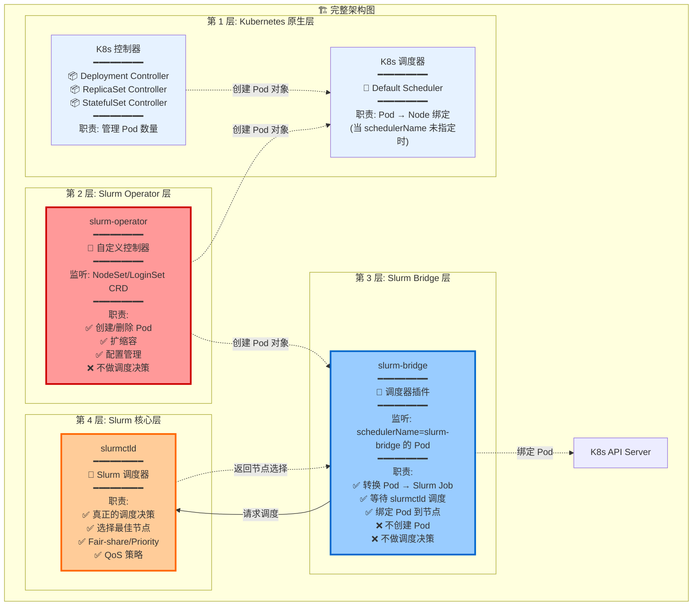
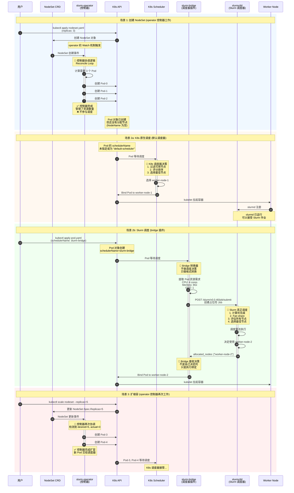
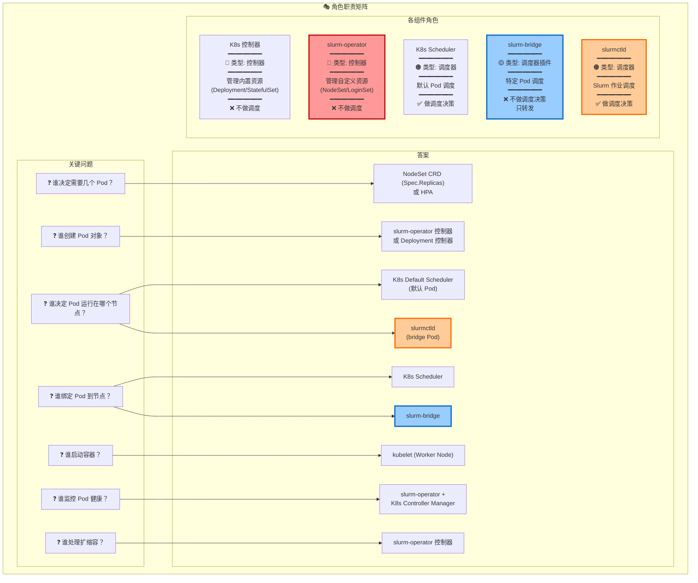
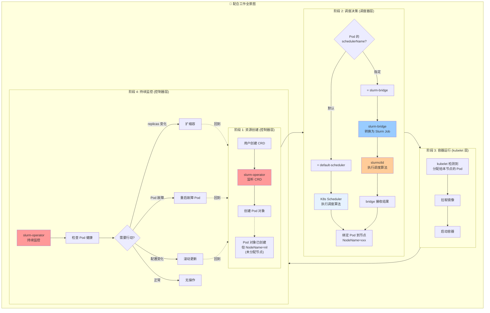

## 三层协作

```mermaid
graph TB
    subgraph architecture["🏗️ 完整架构图"]
        
        subgraph layer1["第 1 层: Kubernetes 原生层"]
            k8s_ctrl["K8s 控制器<br/>━━━━━━━━━<br/>📦 Deployment Controller<br/>📦 ReplicaSet Controller<br/>📦 StatefulSet Controller<br/>━━━━━━━━━<br/>职责: 管理 Pod 数量"]
            
            k8s_sched["K8s 调度器<br/>━━━━━━━━━<br/>🎯 Default Scheduler<br/>━━━━━━━━━<br/>职责: Pod → Node 绑定<br/>(当 schedulerName 未指定时)"]
        end
        
        subgraph layer2["第 2 层: Slurm Operator 层"]
            slurm_op["slurm-operator<br/>━━━━━━━━━<br/>🔧 自定义控制器<br/>━━━━━━━━━<br/>监听: NodeSet/LoginSet CRD<br/>━━━━━━━━━<br/>职责:<br/>✅ 创建/删除 Pod<br/>✅ 扩缩容<br/>✅ 配置管理<br/>❌ 不做调度决策"]
        end
        
        subgraph layer3["第 3 层: Slurm Bridge 层"]
            slurm_bridge["slurm-bridge<br/>━━━━━━━━━<br/>🌉 调度器插件<br/>━━━━━━━━━<br/>监听: schedulerName=slurm-bridge 的 Pod<br/>━━━━━━━━━<br/>职责:<br/>✅ 转换 Pod → Slurm Job<br/>✅ 等待 slurmctld 调度<br/>✅ 绑定 Pod 到节点<br/>❌ 不创建 Pod<br/>❌ 不做调度决策"]
        end
        
        subgraph layer4["第 4 层: Slurm 核心层"]
            slurmctld["slurmctld<br/>━━━━━━━━━<br/>🧠 Slurm 调度器<br/>━━━━━━━━━<br/>职责:<br/>✅ 真正的调度决策<br/>✅ 选择最佳节点<br/>✅ Fair-share/Priority<br/>✅ QoS 策略"]
        end
        
        k8s_ctrl -.->|创建 Pod 对象| k8s_sched
        slurm_op -.->|创建 Pod 对象| k8s_sched
        slurm_op -.->|创建 Pod 对象| slurm_bridge
        slurm_bridge -->|请求调度| slurmctld
        slurmctld -.->|返回节点选择| slurm_bridge
        slurm_bridge -.->|绑定 Pod| k8s_api[K8s API Server]
        
        style k8s_ctrl fill:#e6f2ff
        style k8s_sched fill:#e6f2ff
        style slurm_op fill:#ff9999,stroke:#cc0000,stroke-width:3px
        style slurm_bridge fill:#99ccff,stroke:#0066cc,stroke-width:3px
        style slurmctld fill:#ffcc99,stroke:#ff6600,stroke-width:3px
    end
```


## 完整工作流程对比

```mermaid
sequenceDiagram
    autonumber
    participant User as 用户
    participant CRD as NodeSet CRD
    participant OpCtrl as slurm-operator<br/>(控制器)
    participant K8sAPI as K8s API
    participant K8sSched as K8s Scheduler
    participant BridgeSched as slurm-bridge<br/>(调度器插件)
    participant Slurmctld as slurmctld<br/>(Slurm 调度器)
    participant Node as Worker Node
    
    rect rgb(240, 248, 255)
        Note over User,Node: 场景 1: 创建 NodeSet (operator 控制器工作)
        
        User->>K8sAPI: kubectl apply nodeset.yaml<br/>(replicas: 3)
        K8sAPI->>CRD: 创建 NodeSet 对象
        
        Note over OpCtrl: operator 的 Watch 机制触发
        CRD->>OpCtrl: NodeSet 创建事件
        activate OpCtrl
        
        Note over OpCtrl: 🔧 控制器协调逻辑<br/>Reconcile Loop
        OpCtrl->>OpCtrl: 计算需要 3 个 Pod
        
        OpCtrl->>K8sAPI: 创建 Pod-0
        OpCtrl->>K8sAPI: 创建 Pod-1
        OpCtrl->>K8sAPI: 创建 Pod-2
        
        Note over OpCtrl: ✅ 控制器完成<br/>管理了资源数量<br/>❌ 不参与调度
        deactivate OpCtrl
        
        Note over K8sAPI: Pod 对象已创建<br/>但还没有分配节点<br/>(NodeName 为空)
    end
    
    rect rgb(255, 248, 240)
        Note over User,Node: 场景 2a: K8s 原生调度 (默认调度器)
        
        Note over K8sAPI: Pod 的 schedulerName<br/>未指定或为 "default-scheduler"
        
        K8sAPI->>K8sSched: Pod 等待调度
        activate K8sSched
        
        Note over K8sSched: 🎯 K8s 调度器决策<br/>1. 过滤可用节点<br/>2. 评分排序<br/>3. 选择最佳节点
        
        K8sSched->>K8sSched: 选择 worker-node-1
        K8sSched->>K8sAPI: Bind Pod to worker-node-1
        deactivate K8sSched
        
        K8sAPI->>Node: kubelet 拉起容器
        Node->>Slurmctld: slurmd 注册
        
        Note over Node,Slurmctld: slurmd 已运行<br/>可以接受 Slurm 作业
    end
    
    rect rgb(240, 255, 240)
        Note over User,Node: 场景 2b: Slurm 调度 (bridge 插件)
        
        User->>K8sAPI: kubectl apply pod.yaml<br/>(schedulerName: slurm-bridge)
        
        Note over K8sAPI: Pod 对象创建<br/>schedulerName=slurm-bridge
        
        K8sAPI->>BridgeSched: Pod 等待调度
        activate BridgeSched
        
        Note over BridgeSched: 🌉 Bridge 转换器<br/>不做调度决策<br/>只做格式转换
        
        BridgeSched->>BridgeSched: 提取 Pod 资源需求<br/>CPU: 4 cores<br/>Memory: 8Gi<br/>GPU: 1
        
        BridgeSched->>Slurmctld: POST /slurm/v0.0.40/job/submit<br/>创建占位符 Job
        activate Slurmctld
        
        Note over Slurmctld: 🧠 Slurm 真正调度<br/>1. 计算优先级<br/>2. Fair-share<br/>3. 评估所有节点<br/>4. 选择最佳节点
        
        Slurmctld->>Slurmctld: 调度算法执行
        Slurmctld->>Slurmctld: 决定使用 worker-node-2
        
        Slurmctld-->>BridgeSched: allocated_nodes: ["worker-node-2"]
        deactivate Slurmctld
        
        Note over BridgeSched: 🌉 Bridge 接收决策<br/>不是自己决定的<br/>只是执行绑定
        
        BridgeSched->>K8sAPI: Bind Pod to worker-node-2
        deactivate BridgeSched
        
        K8sAPI->>Node: kubelet 拉起容器
    end
    
    rect rgb(255, 240, 240)
        Note over User,Node: 场景 3: 扩缩容 (operator 控制器再次工作)
        
        User->>K8sAPI: kubectl scale nodeset --replicas=5
        K8sAPI->>CRD: 更新 NodeSet.Spec.Replicas=5
        
        CRD->>OpCtrl: NodeSet 更新事件
        activate OpCtrl
        
        Note over OpCtrl: 🔧 控制器再次协调<br/>检测到 desired=5, actual=3
        
        OpCtrl->>K8sAPI: 创建 Pod-3
        OpCtrl->>K8sAPI: 创建 Pod-4
        
        Note over OpCtrl: ✅ 控制器完成扩容<br/>新 Pod 交给调度器
        deactivate OpCtrl
        
        K8sAPI->>K8sSched: Pod-3, Pod-4 等待调度
        Note over K8sSched: K8s 调度器接管...
    end
```


## 角色职责矩阵


```mermaid
graph TB
    subgraph matrix["🎭 角色职责矩阵"]
        
        subgraph questions["关键问题"]
            Q1["❓ 谁决定需要几个 Pod？"]
            Q2["❓ 谁创建 Pod 对象？"]
            Q3["❓ 谁决定 Pod 运行在哪个节点？"]
            Q4["❓ 谁绑定 Pod 到节点？"]
            Q5["❓ 谁启动容器？"]
            Q6["❓ 谁监控 Pod 健康？"]
            Q7["❓ 谁处理扩缩容？"]
        end
        
        subgraph answers["答案"]
            direction TB
            
            A1["NodeSet CRD (Spec.Replicas)<br/>或 HPA"]
            A2["slurm-operator 控制器<br/>或 Deployment 控制器"]
            A3_k8s["K8s Default Scheduler<br/>(默认 Pod)"]
            A3_slurm["slurmctld<br/>(bridge Pod)"]
            A4_k8s["K8s Scheduler"]
            A4_bridge["slurm-bridge"]
            A5["kubelet (Worker Node)"]
            A6["slurm-operator +<br/>K8s Controller Manager"]
            A7["slurm-operator 控制器"]
            
            Q1 --> A1
            Q2 --> A2
            Q3 --> A3_k8s
            Q3 --> A3_slurm
            Q4 --> A4_k8s
            Q4 --> A4_bridge
            Q5 --> A5
            Q6 --> A6
            Q7 --> A7
        end
        
        subgraph roles["各组件角色"]
            
            R1["K8s 控制器<br/>━━━━━━━━━<br/>🔵 类型: 控制器<br/>━━━━━━━━━<br/>管理内置资源<br/>(Deployment/StatefulSet)<br/>━━━━━━━━━<br/>❌ 不做调度"]
            
            R2["slurm-operator<br/>━━━━━━━━━<br/>🔴 类型: 控制器<br/>━━━━━━━━━<br/>管理自定义资源<br/>(NodeSet/LoginSet)<br/>━━━━━━━━━<br/>❌ 不做调度"]
            
            R3["K8s Scheduler<br/>━━━━━━━━━<br/>🟠 类型: 调度器<br/>━━━━━━━━━<br/>默认 Pod 调度<br/>━━━━━━━━━<br/>✅ 做调度决策"]
            
            R4["slurm-bridge<br/>━━━━━━━━━<br/>🟡 类型: 调度器插件<br/>━━━━━━━━━<br/>特定 Pod 调度<br/>━━━━━━━━━<br/>❌ 不做调度决策<br/>只转发"]
            
            R5["slurmctld<br/>━━━━━━━━━<br/>🟠 类型: 调度器<br/>━━━━━━━━━<br/>Slurm 作业调度<br/>━━━━━━━━━<br/>✅ 做调度决策"]
        end
        
        style A3_slurm fill:#ffcc99,stroke:#ff6600,stroke-width:3px
        style A4_bridge fill:#99ccff,stroke:#0066cc,stroke-width:3px
        style R2 fill:#ff9999,stroke:#cc0000,stroke-width:3px
        style R4 fill:#99ccff,stroke:#0066cc,stroke-width:3px
        style R5 fill:#ffcc99,stroke:#ff6600,stroke-width:3px
    end
```


## 配合工作流程图


```mermaid
graph TB
    subgraph workflow["🔗 配合工作全景图"]
        
        subgraph phase1["阶段 1: 资源创建 (控制器层)"]
            p1_user["用户创建 CRD"]
            p1_op["slurm-operator<br/>监听 CRD"]
            p1_create["创建 Pod 对象"]
            
            p1_user --> p1_op
            p1_op --> p1_create
            
            note1["Pod 对象已创建<br/>但 NodeName=nil<br/>(未分配节点)"]
            p1_create -.-> note1
        end
        
        subgraph phase2["阶段 2: 调度决策 (调度器层)"]
            p2_check{"Pod 的<br/>schedulerName?"}
            
            p2_default["= default-scheduler"]
            p2_bridge["= slurm-bridge"]
            
            p2_check -->|默认| p2_default
            p2_check -->|指定| p2_bridge
            
            p2_k8s["K8s Scheduler<br/>执行调度算法"]
            p2_slurm_start["slurm-bridge<br/>转换为 Slurm Job"]
            p2_slurm_decide["slurmctld<br/>执行调度算法"]
            p2_slurm_return["bridge 接收结果"]
            
            p2_default --> p2_k8s
            p2_bridge --> p2_slurm_start
            p2_slurm_start --> p2_slurm_decide
            p2_slurm_decide --> p2_slurm_return
            
            p2_bind["绑定 Pod 到节点<br/>NodeName=xxx"]
            
            p2_k8s --> p2_bind
            p2_slurm_return --> p2_bind
        end
        
        subgraph phase3["阶段 3: 容器运行 (kubelet 层)"]
            p3_kubelet["kubelet 检测到<br/>分配给本节点的 Pod"]
            p3_pull["拉取镜像"]
            p3_start["启动容器"]
            
            p3_kubelet --> p3_pull --> p3_start
        end
        
        subgraph phase4["阶段 4: 持续监控 (控制器层)"]
            p4_watch["slurm-operator<br/>持续监控"]
            p4_health["检查 Pod 健康"]
            p4_action{"需要行动?"}
            
            p4_watch --> p4_health --> p4_action
            
            p4_scale["扩缩容"]
            p4_restart["重启故障 Pod"]
            p4_update["滚动更新"]
            p4_nothing["无操作"]
            
            p4_action -->|replicas 变化| p4_scale
            p4_action -->|Pod 故障| p4_restart
            p4_action -->|配置变化| p4_update
            p4_action -->|正常| p4_nothing
            
            p4_scale -.->|回到| phase1
            p4_restart -.->|回到| phase1
            p4_update -.->|回到| phase1
        end
        
        phase1 --> phase2 --> phase3 --> phase4
        
        style p1_op fill:#ff9999
        style p2_k8s fill:#e6f2ff
        style p2_slurm_start fill:#99ccff
        style p2_slurm_decide fill:#ffcc99
        style p4_watch fill:#ff9999
    end
```


## 详细的资源预留流程


```mermaid
sequenceDiagram
    autonumber
    participant User as 用户
    participant K8sAPI as K8s API
    participant Bridge as slurm-bridge
    participant SlurmREST as Slurm REST API
    participant Slurmctld as slurmctld
    participant Slurmd as slurmd<br/>(compute-0/1/2)
    participant Kubelet as kubelet
    
    rect rgb(240, 248, 255)
        Note over User,Kubelet: 阶段 1: 创建 Pod，提交占位符
        
        User->>K8sAPI: kubectl apply pod.yaml<br/>schedulerName: slurm-bridge
        
        K8sAPI-->>Bridge: Pod 创建事件<br/>状态: Pending<br/>NodeName: null
        activate Bridge
        
        Note over Bridge: 提取 Pod 资源需求
        
        Bridge->>Bridge: 转换资源请求<br/>CPU: 4 cores<br/>Memory: 8Gi<br/>GPU: 1
        
        Note over Bridge: 构造占位符 Job 请求
        
        Bridge->>SlurmREST: POST /slurm/v0.0.40/job/submit<br/>━━━━━━━━━<br/>job:<br/>  script: "sleep infinity"  ← 占位符<br/>  cpus_per_task: 4<br/>  mem_per_cpu: 2048<br/>  gres: "gpu:1"<br/>  job_name: "k8s-pod-ml-training"<br/>  hold: false  ← 立即调度
        activate SlurmREST
        
        SlurmREST->>Slurmctld: 创建作业请求
        activate Slurmctld
        
        Note over Slurmctld: 💡 关键: Slurm 开始调度<br/>这是一个真实的 Slurm Job<br/>会被记录在队列中
    end
    
    rect rgb(255, 248, 240)
        Note over User,Kubelet: 阶段 2: Slurm 调度决策
        
        Slurmctld->>Slurmctld: 执行调度算法<br/>━━━━━━━━━<br/>1. 计算优先级<br/>2. Fair-share<br/>3. 检查资源可用性<br/>4. QoS 策略
        
        Note over Slurmctld: 查询节点状态
        
        Slurmctld->>Slurmd: 查询 compute-0 状态
        Slurmd-->>Slurmctld: State: IDLE<br/>CPUs: 8 (4 available)<br/>Memory: 16GB (8GB available)<br/>GPU: 1 (available)
        
        Slurmctld->>Slurmd: 查询 compute-1 状态
        Slurmd-->>Slurmctld: State: ALLOCATED<br/>CPUs: 8 (0 available)<br/>━━━━━━━━━<br/>❌ 资源不足，跳过
        
        Slurmctld->>Slurmd: 查询 compute-2 状态
        Slurmd-->>Slurmctld: State: IDLE<br/>CPUs: 8 (8 available)<br/>Memory: 16GB (16GB available)<br/>GPU: 1 (available)
        
        Note over Slurmctld: 评分:<br/>compute-0: 适合 (50分)<br/>compute-1: 不可用 (0分)<br/>compute-2: 最佳 (100分)<br/>━━━━━━━━━<br/>决定: compute-2
        
        Slurmctld->>Slurmctld: 分配作业到 compute-2<br/>━━━━━━━━━<br/>JobID: 12345<br/>NodeList: compute-2<br/>State: RUNNING  ← 关键状态
        
        Note over Slurmctld: ⚠️ 重要: 资源已预留!<br/>━━━━━━━━━<br/>compute-2 状态更新:<br/>IDLE → ALLOCATED<br/>━━━━━━━━━<br/>CPUs allocated: 4<br/>Memory allocated: 8GB<br/>GPU allocated: 1
        
        Slurmctld->>Slurmd: 通知 compute-2<br/>启动 Job 12345<br/>━━━━━━━━━<br/>但这是占位符 Job<br/>srun sleep infinity
        activate Slurmd
        
        Note over Slurmd: 在后台运行 sleep 进程<br/>PID: 54321<br/>━━━━━━━━━<br/>这个进程几乎不消耗资源<br/>只是占位用
        
        Slurmctld-->>SlurmREST: 作业已调度<br/>JobID: 12345<br/>State: RUNNING<br/>NodeList: ["compute-2"]
        deactivate Slurmctld
        
        SlurmREST-->>Bridge: Response:<br/>━━━━━━━━━<br/>job_id: 12345<br/>job_state: "RUNNING"<br/>nodes: "compute-2"<br/>allocated_nodes: {<br/>  "compute-2": {<br/>    cpus: 4,<br/>    memory: 8192,<br/>    gres: "gpu:1"<br/>  }<br/>}
        deactivate SlurmREST
        
        Note over Bridge: ✅ 收到调度结果<br/>Slurm 选择了 compute-2<br/>资源已在 Slurm 中锁定
    end
    
    rect rgb(240, 255, 240)
        Note over User,Kubelet: 阶段 3: 绑定 Pod 到节点
        
        Note over Bridge: 需要找到 compute-2<br/>对应的 K8s Worker 节点
        
        Bridge->>K8sAPI: 查询: 哪个 Worker 运行着<br/>compute-2 这个 Pod?
        K8sAPI-->>Bridge: compute-2 Pod 在 worker-node-2
        
        Note over Bridge: 映射关系:<br/>Slurm Node: compute-2<br/>→ NodeSet Pod: compute-2<br/>→ K8s Worker: worker-node-2
        
        Bridge->>K8sAPI: Bind 用户 Pod to worker-node-2<br/>━━━━━━━━━<br/>binding:<br/>  target:<br/>    name: worker-node-2<br/>  metadata:<br/>    annotations:<br/>      slurm.job.id: "12345"<br/>      slurm.node: "compute-2"
        
        K8sAPI-->>Kubelet: Pod 已绑定到 worker-node-2<br/>请启动 Pod
        
        deactivate Bridge
        
        Kubelet->>Kubelet: 拉取镜像<br/>创建容器<br/>启动应用
        
        Note over Kubelet: 用户 Pod 启动成功<br/>━━━━━━━━━<br/>PID: 99999<br/>运行: python train.py
        
        Kubelet-->>K8sAPI: Pod Running
        
        Note over Bridge,Slurmd: ⚠️ 此时状态:<br/>• Slurm: Job 12345 RUNNING<br/>• K8s: Pod Running<br/>• 两边都认为资源被占用
        
    end
    
    rect rgb(255, 240, 240)
        Note over User,Kubelet: 阶段 4: 清理占位符
        
        Note over Bridge: 可选: 清理 sleep 占位符<br/>或保持占位符运行<br/>作为资源标记
        
        alt 方案 A: 保持占位符
            Note over Slurmd: sleep infinity 继续运行<br/>占用很少资源<br/>作为 Slurm 的资源标记
        else 方案 B: 替换占位符
            Bridge->>SlurmREST: 更新 Job 12345<br/>替换为真实的命令
            SlurmREST->>Slurmctld: 更新作业
            Slurmctld->>Slurmd: 终止 sleep<br/>启动新命令
        end
        
        Note over User,Kubelet: 用户任务执行中...
        
        Kubelet->>Kubelet: 任务完成<br/>容器退出
        
        Kubelet-->>K8sAPI: Pod Succeeded
        
        K8sAPI-->>Bridge: Pod 完成事件
        activate Bridge
        
        Bridge->>SlurmREST: 完成 Job 12345<br/>scancel 12345
        activate SlurmREST
        
        SlurmREST->>Slurmctld: 取消作业
        activate Slurmctld
        
        Slurmctld->>Slurmd: 终止 Job 12345
        
        Note over Slurmd: 清理占位符<br/>或真实任务<br/>━━━━━━━━━<br/>释放资源
        
        deactivate Slurmd
        
        Note over Slurmctld: 释放资源<br/>━━━━━━━━━<br/>compute-2:<br/>ALLOCATED → IDLE<br/>━━━━━━━━━<br/>CPUs: 0 → 4 available<br/>Memory: 0 → 8GB available
        
        deactivate Slurmctld
        deactivate SlurmREST
        deactivate Bridge
        
        Note over User,Kubelet: ✅ 完整流程结束<br/>资源已释放
    end
```


```mermaid

```