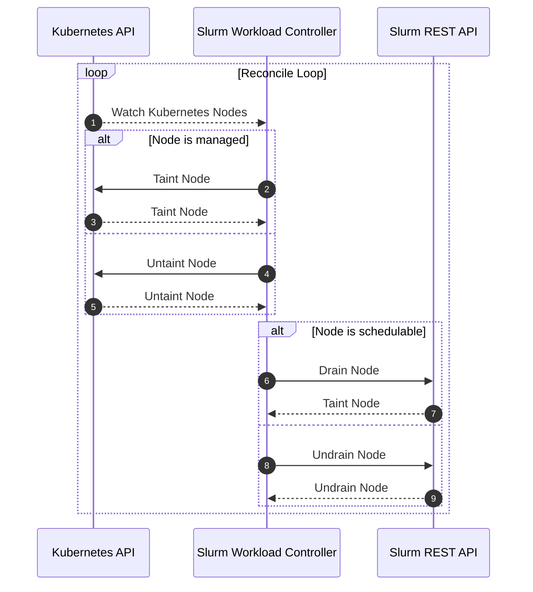
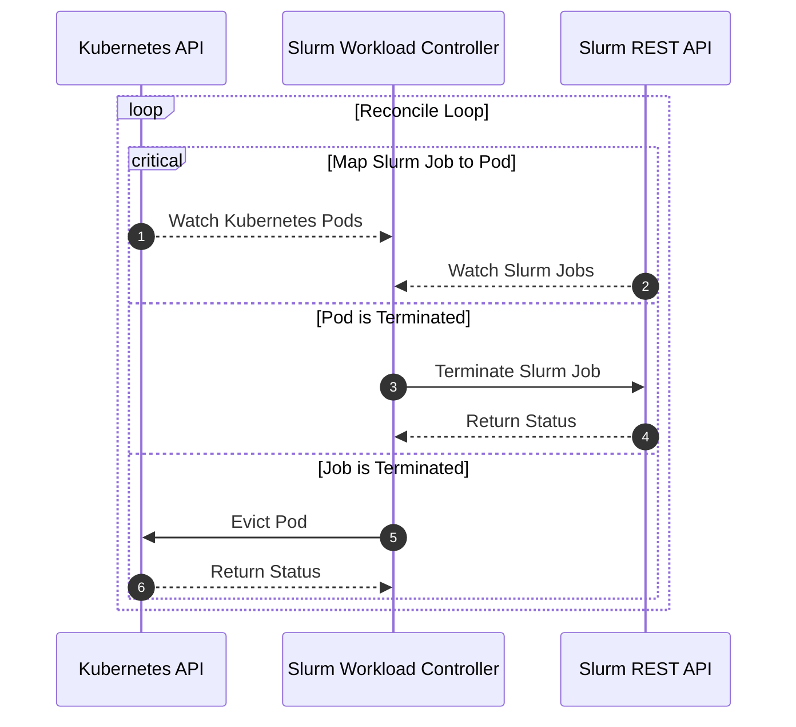

# Controllers

## Table of Contents

<!-- mdformat-toc start --slug=github --no-anchors --maxlevel=6 --minlevel=1 -->

- [Controllers](#controllers)
  - [Table of Contents](#table-of-contents)
  - [Overview](#overview)
  - [Node Controller](#node-controller)
  - [Workload Controller](#workload-controller)

<!-- mdformat-toc end -->

## Overview

[The Kubernetes documentation](https://kubernetes.io/docs/concepts/architecture/controller/)
defines controllers as:

> control loops that watch the state of your cluster, then make or request
> changes where needed. Each controller tries to move the current cluster state
> closer to the desired state.

Within `slurm-bridge`, there are multiple controllers that manage the state of
different bridge components:

- **Node Controller** - Responsible for tainting the Kubernetes nodes that are
  managed by `slurm-bridge`
- **Workload Controller** - Responsible for synchronizing Slurm and Kubernetes
  workloads on the nodes that are managed by `slurm-bridge`

## Node Controller

The node controller is responsible for tainting the managed nodes so the
scheduler component is fully in control of all workload that is bound to those
nodes.

Additionally, this controller will reconcile certain node states for scheduling
purposes. Slurm becomes the source of truth for scheduling among managed nodes.

A managed node is defined as a node that has a colocated `kubelet` and `slurmd`
on the same physical host, and the slurm-bridge can schedule on.

## Workload Controller

The workload controller reconciles Kubernetes Pods and Slurm Jobs. Slurm is the
source of truth for what workload is allowed to run on which managed nodes.

